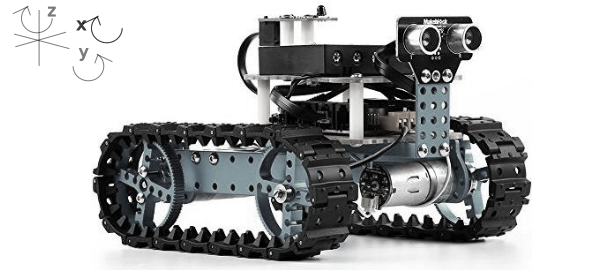

## programmation

Le mBlock ranger comprend le langage de programmation C++, plus précisement dans le context d'Arduino, qui nous permet d'utiliser des boucles pour répéter des instructions pour un certain nombre de répétitions voire vers l'infini, notamment, tous les programmes arduino comprend une partie `loop()`, qui s'agit d'une boucle infinie. (Q2) Les boucles nous permets de faire marcher le robot de manière autonome dans un contexte défini.

### Utilisation des capteurs

Le robot mBlock ranger que nous avons manipulé possède plusieurs capteurs:

- capteurs de lumière (2)
- capteurs de son
- capteurs de distance ultrasonic
- gyroscope

Les capteurs de lumière et son capturent des signals analogues, puis les convetissent en signals numériques par approximation. Plus précisement, le capteur de lumière capture le niveau de luminosité, puis le convetit en integer 0-1024.(Q1), où le capteur de bruit suit le même processus pour niveau de bruit. Empiriquement, nous trouvons que en silence, le mésure numérique est en-dessous de 100, où avec un fond de bruit léger dans la salle de TP la valeur est alentours de 200, et le fait de parler au robot augment la valeur à l'alentour de 500. (Q6)

Le capteur de distance ultrasonic, qui calcule la distance d'obstacle en face par mésure du temps entre l'émission d'un signal ultrasound et la réception de la réflexion de l'obstacle. Empiriquement, nous avons identifié le domaine de mésurement à 0-4000mm. La sensitivité est 10mm (Q9).

Le gyroscope mésure l'orientation du robot dans toutes les trois dimensions. Alors que le robot est dans l'orientation naturelle par terre, les valeurs y et x sont 0. La valeur 0 pour z est simplement l'orientation horizonal à l'initiation. La valeur z donc mésure l'angle entre l'orientation actuel du robot par rapport de l'initial, dans la limite de -180 et 180 degrés.

### sorties/retours

Le mBlock ranger est équipé d'un panneau de 12 LED et 2 moteurs. Cela signifie qu'on peut avoir des retours visuels en plus des retours automotifs.

#### LEDs

Les 12 LEDs sont contrôlée par la classe `MeRGBLed`, qui nous permet de contrôler tous les LEDs à la fois par `{instance}.setColor(0,R,G,B);`, ou `{instance}.setColor(i,R,G,B);`, où i est un entier entre 1 et 12, et R,G,B sont des valeurs de luminosité pour les couleurs rouge, vert et bleu respectivement. Tous couleurs peuvent être affiché par une combination de rouge, vert, bleu. Jaune, par exemple, a une valeur RGB de (255,255,0) (Q5).

#### Motors

Les moteurs de mBlock ranger sont controlés par la classe `MeEncoderOnBoard`, qui nous permet de régler la vitesse des moteurs par `motor.setMotorPwm(v);`, where `v`doit être un entier entre 0 et 255. 255 correspond à plein vitesse, et 0 correspond à l'arrêt complet.

Comme les moteurs sont des moteurs pas à pas, il est également possible de faire marcher les moteurs pour une certaine distance avec `
moveDegrees(1-4,degrees,speed)
